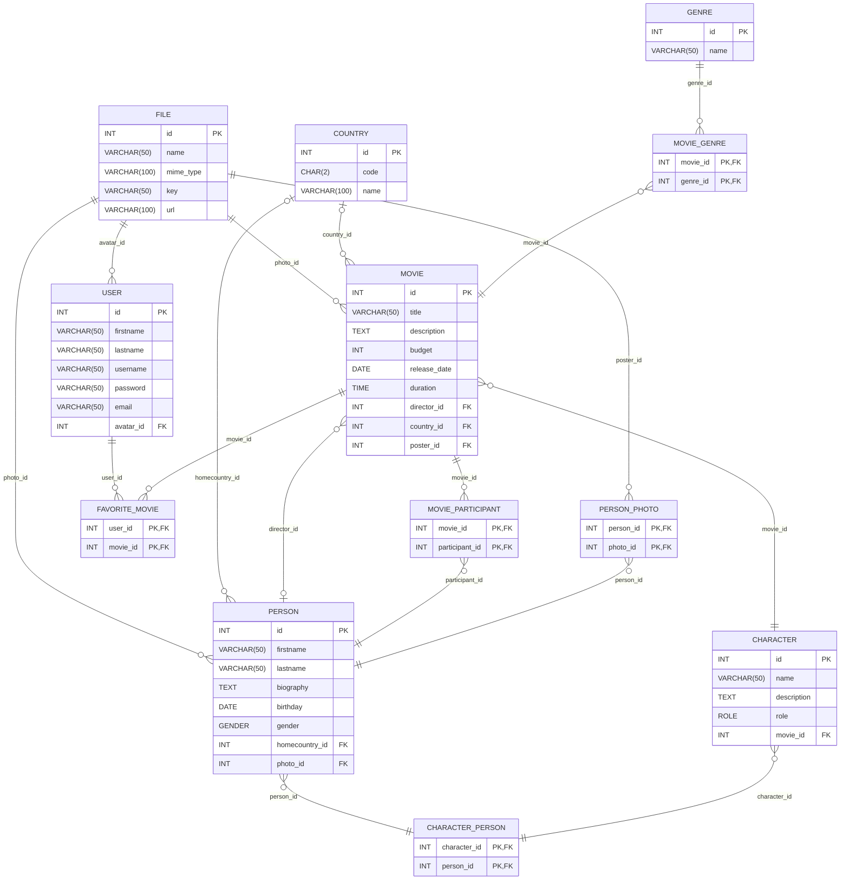

# BSA homework: DB & SQL

[setup.sql](./setup.sql) file contains all DDL statements to craete all the tables.

Here is an ER Diagram which represent reletionships between tables.
Note that each table also contain `created_at` and `updated_at` attributes, but they are not present in the diagram for compactness and readability purposes.

